# Lab 1 - Introduction to LabView

## Exercise 1 - Data Types in LabView
#### Block Diagram - Convert name into byte value, then convert from Fahrenheit to Celsius
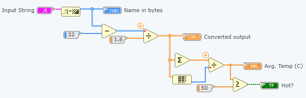
#### Panel - Running conversion of name from Fahrenheit to Celsius
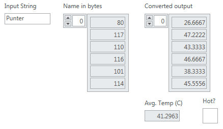
#### Block Diagram - Get integer value of first three characters
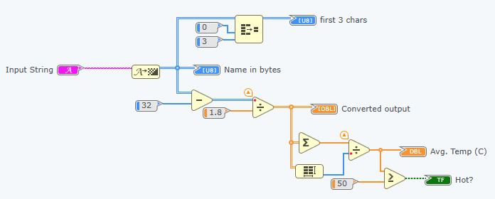
#### Panel - Running integer value of first three characters
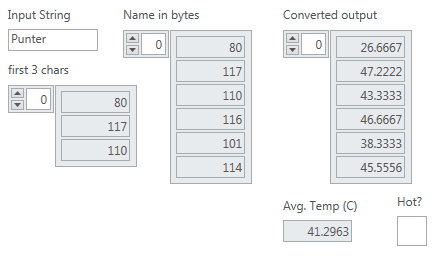

## Exercise 2 - Implementation of the Central Limit Theorem
- First, we created a uniform distribution generator.
- By repeatedly generating uniformly distributed random numbers, we observed the sample mean converging to a normal distribution.

#### Diagram 1
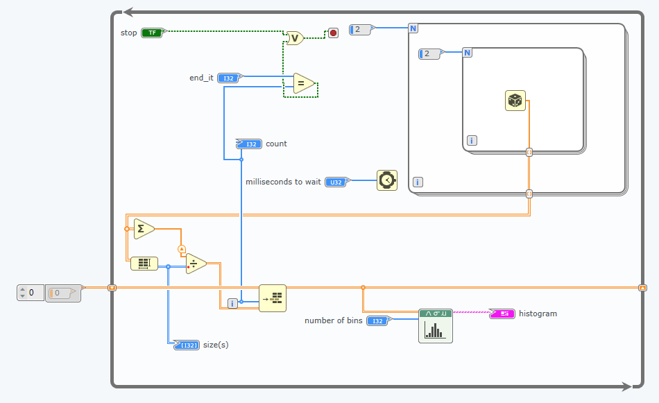
### Output:
#### Histogram 1
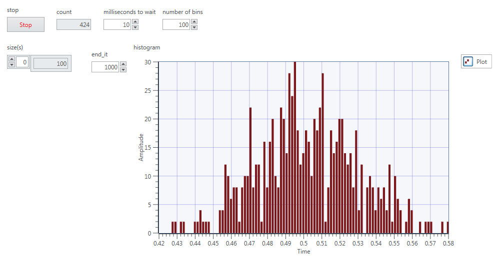

### Task: to standardize the normal distribution produced by the Central Limit Theorem
- Subtracted the mean from the random variable, and then dividing by the standard deviation

#### Diagram 2
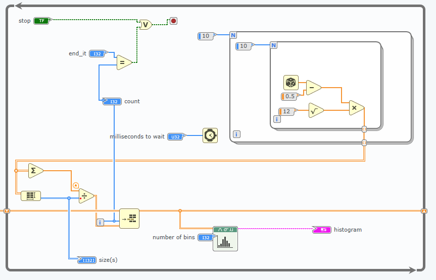

### New output was as follows:
#### Histogram 2
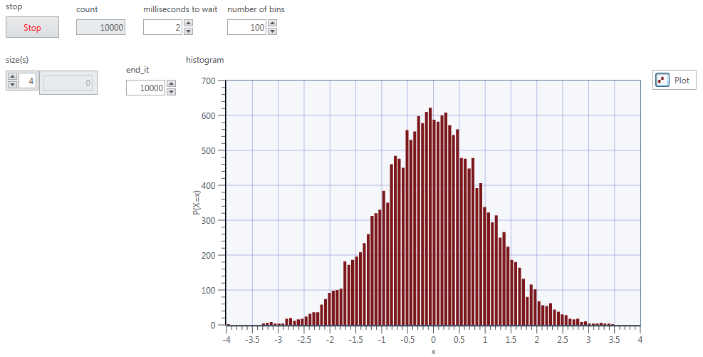

## Exercise 3
#### Block Diagram - Just lowpass filter
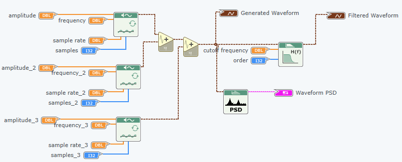
#### Front Panel - Just lowpass filter output
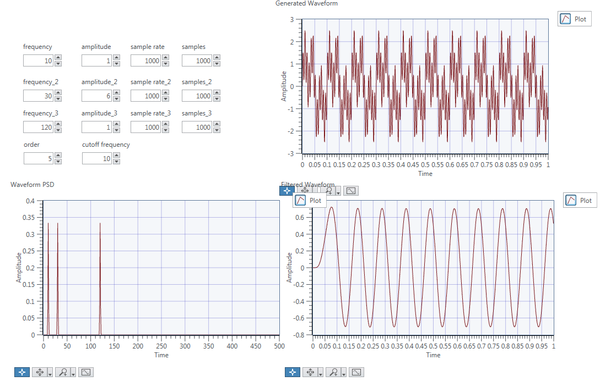
#### Block Diagram - Bandpass filter
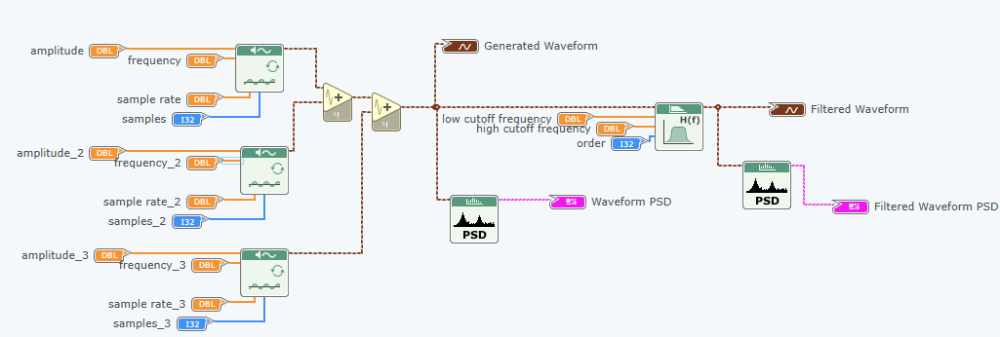
#### Front Panel - Bandpass filter output
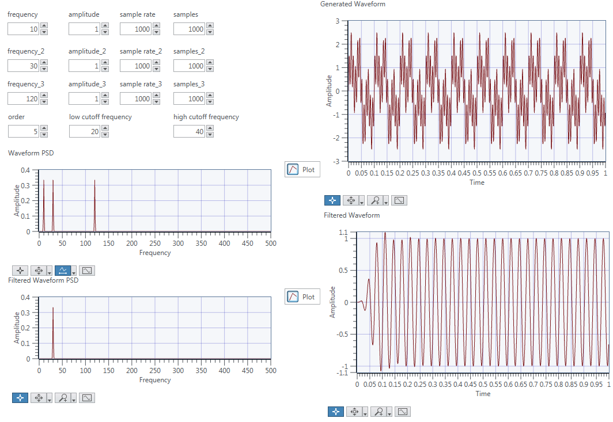

