# Lab 2 - AM Simulation and USRP

## Exercise 1 - AM Modulation
The standard equation for AM signals:

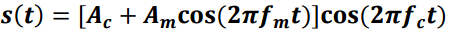

In this first exercise, we built an AM modulater following the standard equation where the carrier wave's amplitude is changed with respect to the message signal. The fully built diagram is as follows:

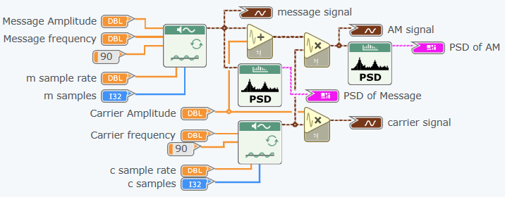

We set the parameters for the message and carrier signal to the following:
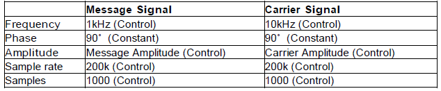

We then altered the modulation index and looked at the changes that appeared:

Modulation index = 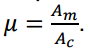

### Effect of Modulation Index 
Mod Index = 0.5: 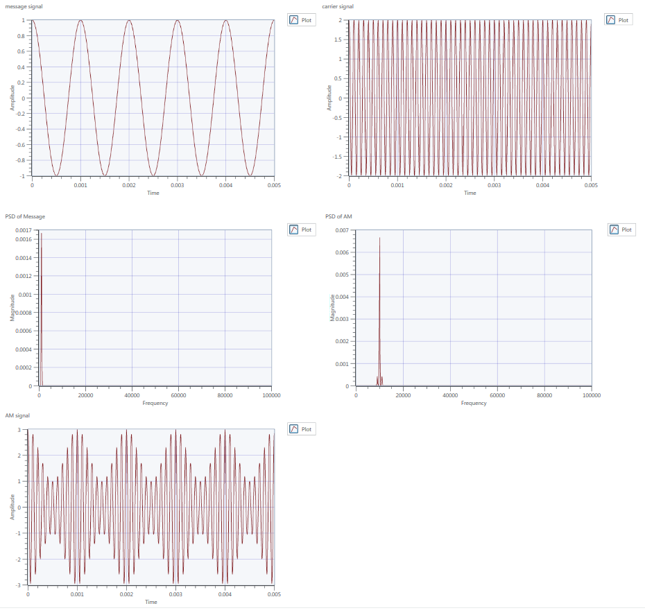
--
Mod Index = 1:  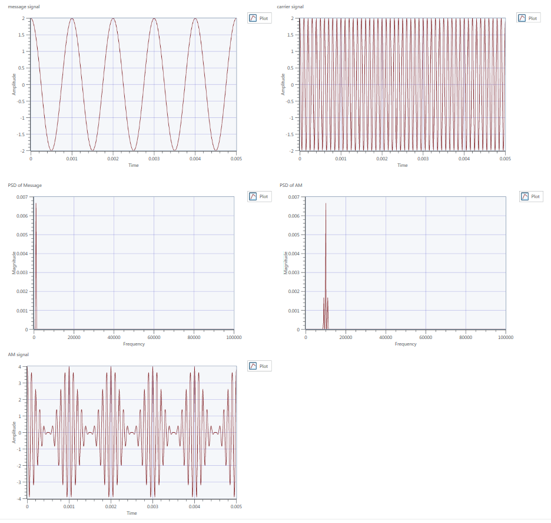
--
Mod Index = 1.5:  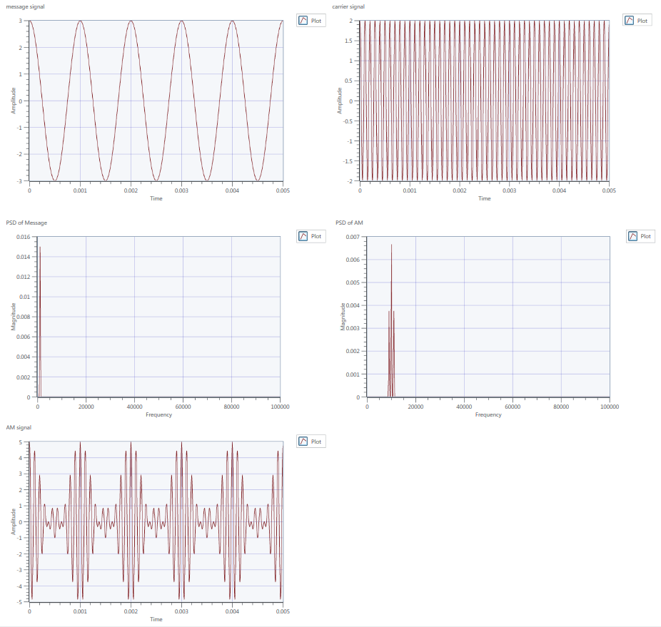
--

### Observations
Two points can be observed with increasing modulation index: The sidebands extend out and increase in magnitude; there is an increase modulation depth. At 0.5, the signal is undermodulated, has low modulation depth and therefore does not utilise the carrier efficiently. At 1, the modulation depth reaches zero and at index of 1.5 over modulation occurs. The carrier signal goes below the zero point and phase reversal is exhibited. The phase reversal caused the sidebands to stretch out - this may cause intereference and must be filtered.

### Effect of increasing frequency of the message
Fm = 1kHz: 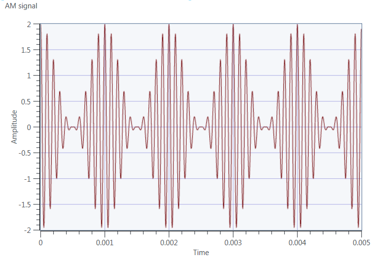
--
Fm = 2kHz:  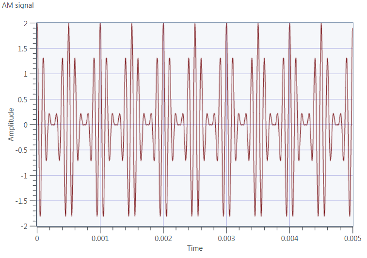
--
Fm = 5kHz:  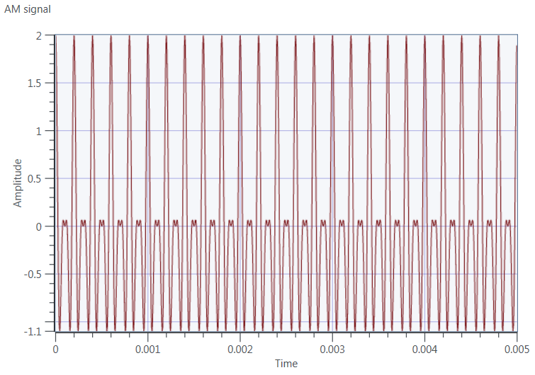
--

### Observations
* When the message frequency is lower, the waveform is symmetrical around the x-axis.
* At 5k, the waveform becomes malformed because there is an operlap between -fc+fm and fc-fm.
* "Nyquist Rate" - message bandwidth must be at most half the carrier bandwidth.

## Exercise 2a) - Coherent Demodulation
In this exercise, we built a AM Demoulator which uses coherent demodulation.
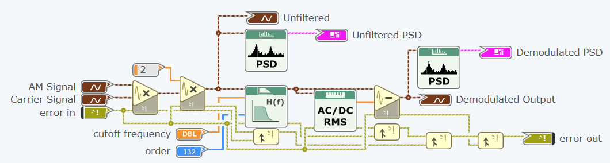

## Theory
The carrier signal m(t)cos(2pifct) when received by the receiver is multiplied by cos(2pifct).

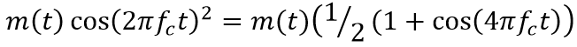

Using a low pass filter, centered around the baseband, the output signal will be 1/2m(t).

Therefore to retrieve the original signal amplitude, we multiply the output by 2.

## Exercise 2b) - Envelope Detection
In this exercise, we built another AM demoulator which uses envelope detection.
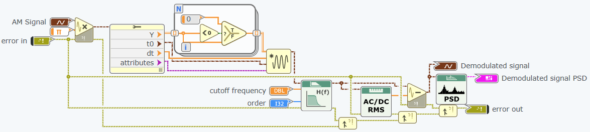

## Theory
The envelope detector outputs the envelope of one half of the signal. The high frequency element is then filtered out.
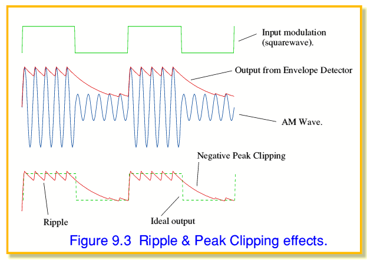

## Exercise 3
Here we simulated the AM Modulator and Demodulator working together.

Diagram:
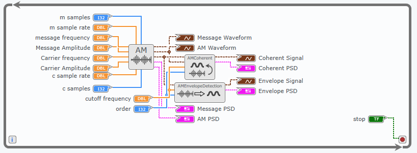

* Envelope detection is better at high frequencies.
* Envelope detection works until the modulation index goes above 1; at that point only coherent detection works correctly because during modulation the envelope signal has parts that are left negative.
* Coherent detection is fine at >1 modulation indexes, but requires the transmitter and receiever to be in phase and at the same frequency.

## Exercise 4
Universal Software Radio Peripheral components:
1. niUSRP Open Tx Session
2. niUSRP Configure Signal
3. niUSRP Write Tx Data
4. niUSRP Close Session
5. niUSRP Open Rx Session
6. niUSRP Initiate
7. niUSRP Fetch Rx data
8. niUSRP Abort

If the baseband discrete time signal is expressed as:
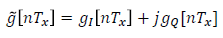
then the continuous time transmitted signal from the USRP is
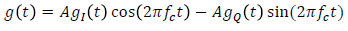

### Explain how the transmitter and receiver work.
* The modules provide the USRP with complex data representing the signal.
* The USRP modulates the signal, giving the above continuous time signal if given a baseband time signal as above.
* At the receiver the USRP demodulates the signal and returns the demodulated signal.
* The signal is very noisy.

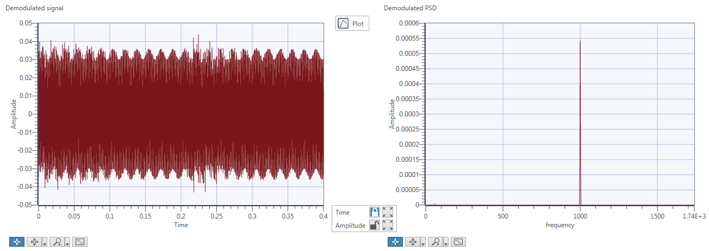

### Single tone 5kHz
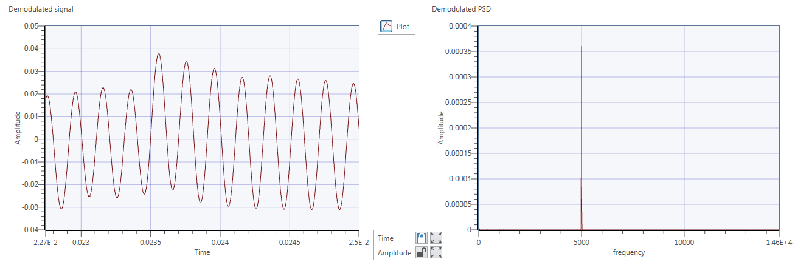

To observe the effect of noise in the demodulated signal, increase the receiver’s gain to 20
dB (your receiver will start to detect other weaker signals in addition to the transmitted signal), and
adjust the X axis of the demodulated message (in time domain) to show values between 0 second
(s) and 0.004 s. Then, change the modulation index (𝜇) value and observe the effects on the plots
of the demodulated signal in both time and frequency. From what value of can noise be clearly
noticed in the plots?

* We increased the receiver gain to 20, and the modulation index all the way up to 100, and received the following noise:

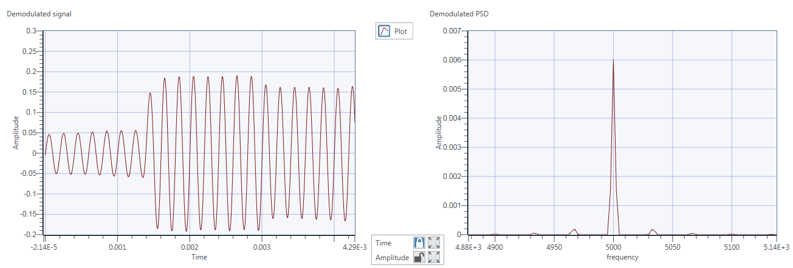
