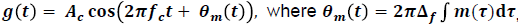
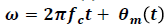
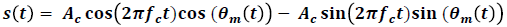
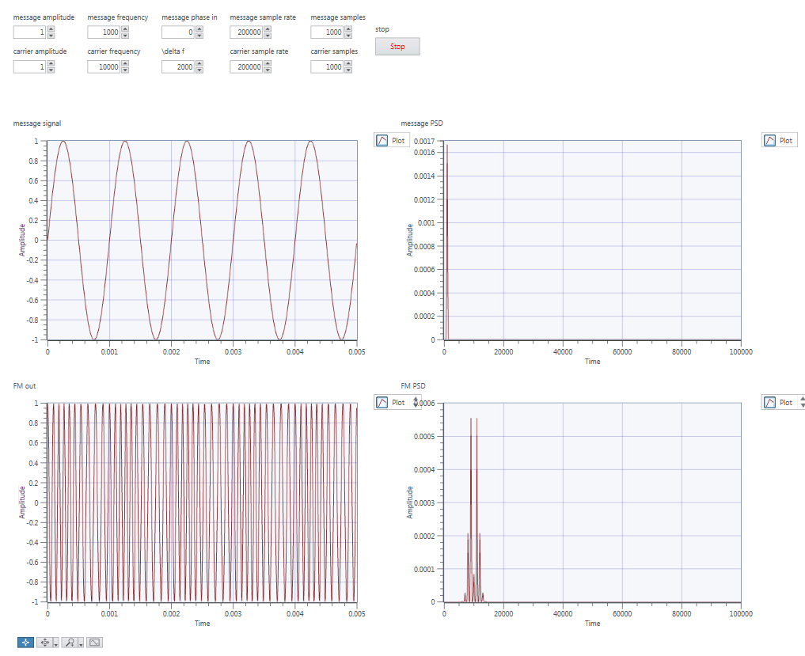

# Lab 3: FM Simulation and USRP

## Exercise 1: FM Modulator

Generalised function for FM is:

Instantaneous frequency is:

Equivalent form we will be using:

## Diagram

## Varying _delta f_
### _delta f_=500

### _delta f_=2000

### _delta f_=5000

* As delta f increases, you can more easily see the variations in frequency of the FM signal.
* In the frequency domain, you can see the message signal spread across a larger bandwidth.

## Exercise 2: FM Demodulator

* Theory is that the derivative provides a sinusoidal signal which has amplitude proportional to the message signal.
* This is just like AM modulation, so the envelope detection method works to retrieve the signal from the differentiated signal.
* Coherent detection would not work because we do not know the phase of the resultant signal

### Envelope Detection

## Exercise 3: FM Simulation

### Top level Diagram

## Exercise 4: FM USRP

### Delta f = 1kHz

### Delta f = 5kHz

### Delta f = 30kHz

* Note that the bandwidth of this signal is 62kHz, which agrees with Carsons rule for delta f = 30kHz and B = 1kHz:
 = 62kHz.

