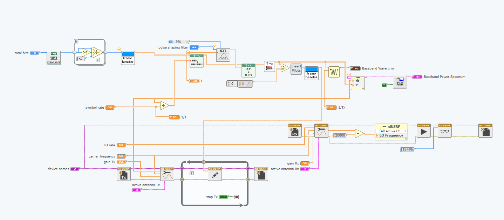
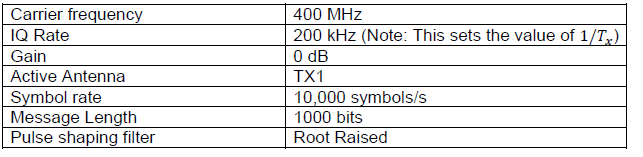
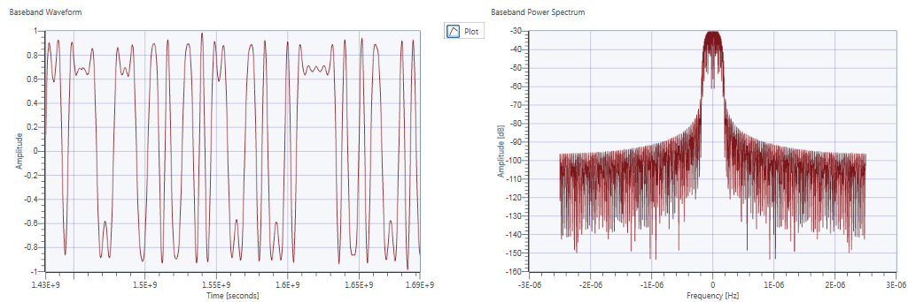
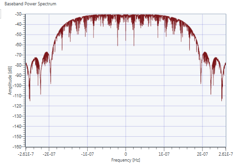
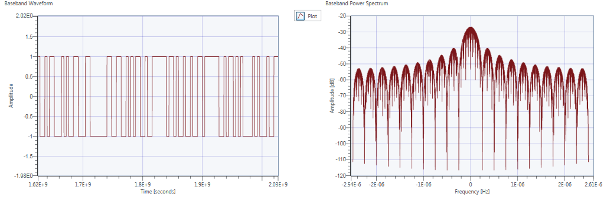
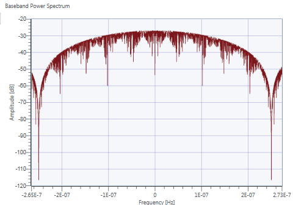
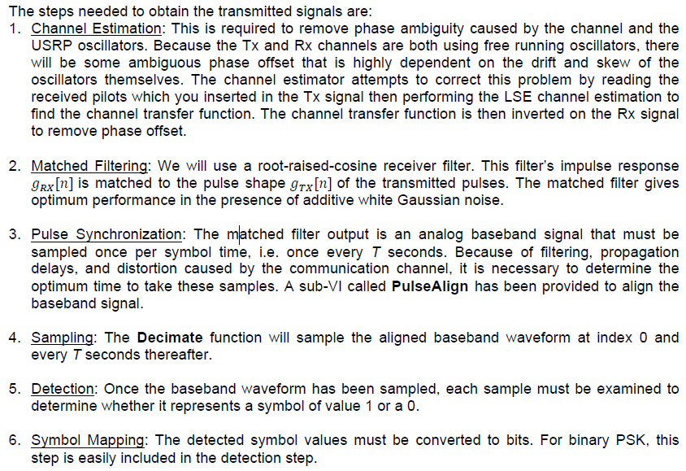
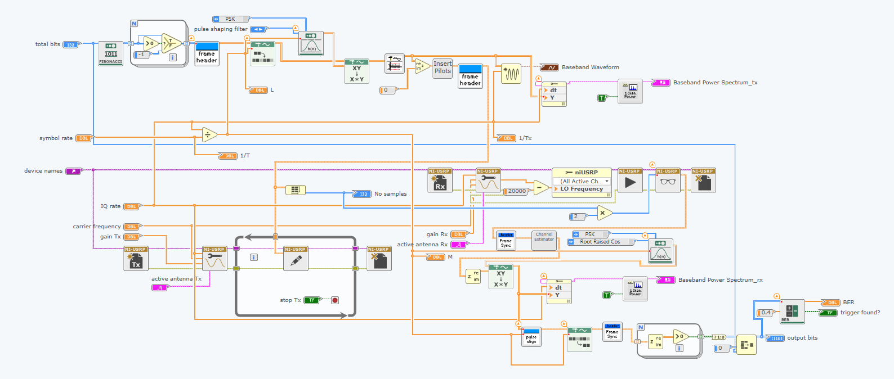
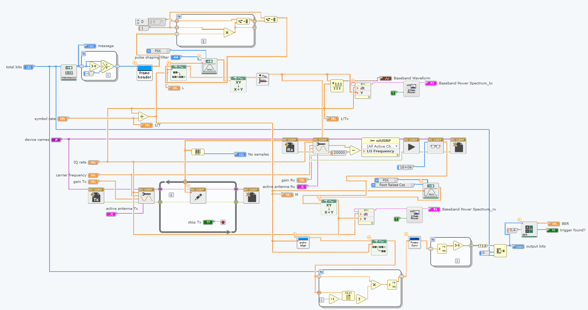

# Lab 4

## Exercise 1 - BPSK Transmitter

### Aim
In this exercise, we constructed a BPSK Transmitter 
	
Diagram:

	
### Observation
Values: 

	
For a IQ Rate of 200k and a symbol rate of 10k the number of samples per symbol is 20.
	
Graphs for values above: 
	
Main lobe: 
	
Main lobe bandwidth: *_INSERT SOMETHING_*
	
No pulse shaping filter graphs: 
	
No pulse shaping filter main lobe: 
	
Main lobe bandwidth: *_INSERT SOMETHING_*
	
* We observed that without a pulse shaping filter, the sideband lobes continued for a larger frequency range. This is because without a pulse shaping filter, higher frequency elements are required due to the rapid change in the message signal.
* Spectral rolloff is much faster using the pulse shaping filter.

## Exercise 2 - BPSK Receiver

### Aim
	
In this exercise, we constructed the BPSK Receiver 
	
Diagram:

### Observation

| Tx Gain (dB)  | Rx Gain (dB)  | BER1 | BER2 | BER3 | BER4 | BER5 | Average BER |
|:-------------:|:-------------:|:----:|:----:|:----:|:----:|:----:|:-----------:|
| 0             | 0             |0.499 |0.508 | 0.002| 0.002|0.003 |0.203        | 
| -35           | -15           |0.505 |0.470 |0.002 |0.496 |0.536 |0.389        | 
| -37           | -15           |0.190 |0.506 |0.463 |1     |0.480 |0.528        | 
| -40           | -15           |0.487 |0.466 |1     |0.470 |0.469 |0.587        |

## Exercise 3 - Error Correction Coding

### Aim

### Observation
* BER Module does not allow the program to compile.
* After doing all the steps, the program still did not work until the following steps were done:
1. Needed to turn the output from the final pulse align module to real from complex.
2. Needed to put a large constant into the number of samples port of the niUSRP Fetch Rx Data port so that it doesn't stop receiving data before the transmitter finishes transmitting.

Finally, when it was working, the BER was much lower:

| Tx Gain (dB)  | Rx Gain (dB)  | BER1 | BER2 | BER3 | BER4 | BER5 | Average BER |
|:-------------:|:-------------:|:----:|:----:|:----:|:----:|:----:|:-----------:|
| 0             | 0             |0 |0 | 0| 0|0 |0        | 
| -35           | -15           |0.001 |0 |0.438 |0.369 |0 |0.162        | 
| -37           | -15           |0.452 |0.256 |0.353 |0.490     |0.457 |0.402        | 
| -40           | -15           |1 |0.457 |0.480     |0.506 |0.501 |0.589        |

## Exercise 4 - Differential Phase Shift Keying (DPSK)

### Aim
In this exercise, we constructed a DPSK Encoder and Decoder and added it to the transmitter and receivers
	
Diagram:

### Observation
| Tx Gain (dB)  | Rx Gain (dB)  | BER1 | BER2 | BER3 | BER4 | BER5 | Average BER |
|:-------------:|:-------------:|:----:|:----:|:----:|:----:|:----:|:-----------:|
| 0             | 0             |0 |0 | 0| 0.507|0.449 |0.191        |
| -35             | -15             |0.491 |0 | 0| 0.489|0 |0.196        |
| -37             | -15             |0.060 |0.481 | 0.022| 0.456|0.001 |0.204        |
| -40             | -15             |1 |0.171 | 0.501| 1|0.495 |0.633        |

## Comparison between DPSK and BPSK
For the initial
