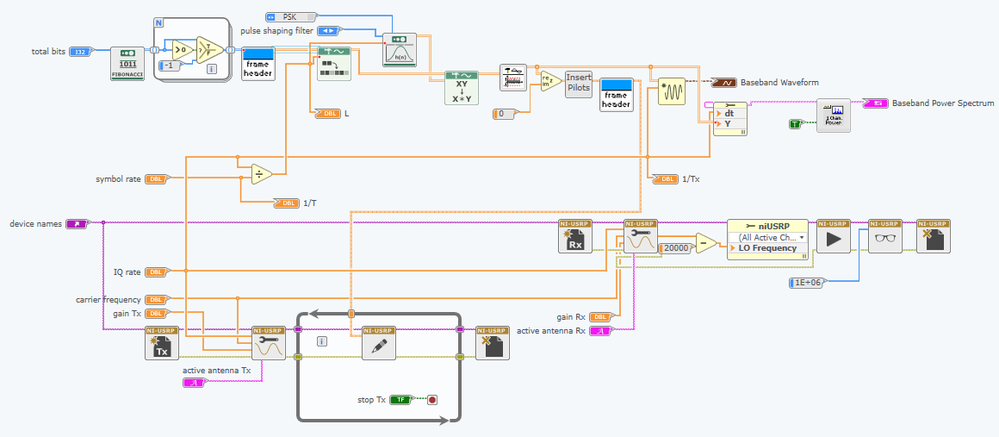

# Lab 4

## Exercise 1 - BPSK Transmitter

### Aim
	In this exercise, we constructed a BPSK Transmitter 
	
	Diagram:
	
	
### Observation
	
	For a IQ Rate of 200k and a symbol rate of 10k the number of samples per symbol is 20. 

## Exercise 2 - BPSK Receiver

### Aim

	

### Observation

## Exercise 3 - Error Correction Coding

### Aim

### Observation

## Exercise 4 - Differential Phase Shift Keying (DPSK)

### Aim

### Observation